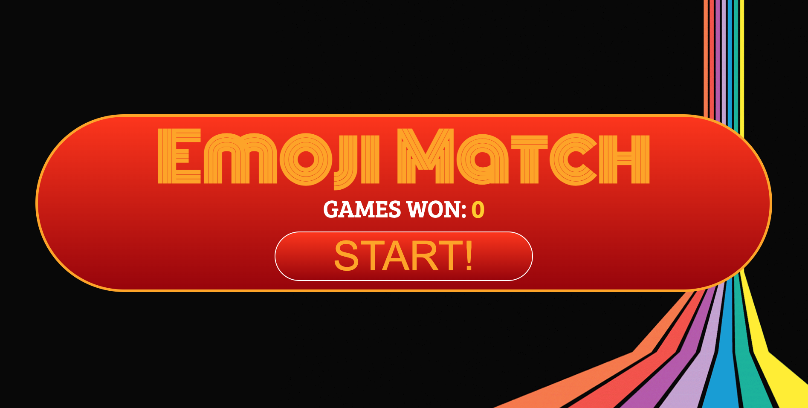

## Emoji Matcher - Memory Game

Emoji Matcher is a simple memory card matching game built with React. The goal of the game is to match pairs of emoji cards. 



### Prerequisites

Before you can use Emoji Matcher, make sure you have the following dependencies installed:

- [Lodash](https://lodash.com/)
- [React](https://reactjs.org/)
- [ReactDOM](https://reactjs.org/docs/react-dom.html)

### Getting Started

To use Emoji Matcher, follow these steps:

1. Clone or download this repository to your local machine.

2. Install the required dependencies (if not already installed):

   ```bash
   npm install lodash react react-dom
   ```

3. Include the game code in your HTML file, e.g., `index.html`:

   ```html
   <div id="app"></div>
   ```

4. Create a JavaScript file (e.g., `emoji-matcher.js`) and include the provided code.

5. In your JavaScript file, initialize the game by rendering the `MemoryGame` component:

   ```javascript
   ReactDOM.render(<MemoryGame />, document.getElementById("app"));
   ```

6. Start a local server or open your HTML file in a web browser.

### How the Game Works

- Emoji Matcher is a memory game where you need to match pairs of emoji cards.

- The game board consists of a grid of cards with different emoji faces.

- Click on two cards to reveal their faces. If the emojis match, the cards will remain face-up; otherwise, they will flip back face-down.

- The game tracks the number of games won, and the goal is to match all pairs and win the game.

- Click the "Start!" button to shuffle the cards and begin a new game.

### Game Logic

The `MemoryGame` component handles the game logic. It includes functions for shuffling cards, picking cards, and checking for matches. It also manages the game's state, keeping track of selected cards, games won, and the game's progress.

### Customization

You can customize the game by changing the `uniqueCards` array to use different emoji names and the `numCardsToMatch` variable to set the number of cards that need to match for a successful pair.

### Note

Please make sure you have a basic understanding of React and how to set up a React application before using this code.

### Try It Out

Enjoy playing Emoji Matcher 🎉 by visiting the following link:

[Play Emoji Matcher](https://mconour.github.io/emoji-matcher/)
